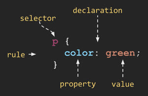
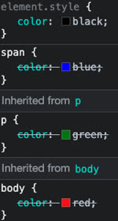

# Cascading Style Sheets


<iframe src="https://docs.google.com/presentation/d/e/2PACX-1vQRrNtrNhocW1BbO-LuXLwxNiV_N1ApAOprbtXgk6jJABVKnMd1OcJFires3aEQMLeBfL2bUx3leabC/pubembed?start=false&loop=false&delayms=3000" frameborder="0" width="900" height="540" allowfullscreen="true" mozallowfullscreen="true" webkitallowfullscreen="true"></iframe>


📖 **Deeper dive reading**: [MDN CSS](https://developer.mozilla.org/en-US/docs/Web/CSS)

Cascading Style Sheets (CSS) converts the structure and content of HTML into a vibrant, responsive experience. The initial objective of CSS was to simply style the HTML based upon the desires of the user, developer, and browser. In modern web applications CSS styling focuses more on helping the developer create complex renderings of dynamic content that is responsive to the actions of the user and the device the application is rendered on. With CSS a web programmer can animate the page, deploy custom fonts, respond to user actions, and dynamically alter the entire layout of the page based on the size of a device and its orientation.

Functionally, CSS is primarily concerned with defining `rulesets`, or simply `rules`. A rule is comprised of a `selector` that selects the elements to apply the rule to, and one or more `declarations` that represent the `property` to style with the given `property value`.



For example, consider the following rule.

```css
p {
  font-family: sans-serif;
  font-size: 3em;
  font-weight: 200;
  color: navy;
  text-shadow: 3px 3px 1px #cccccc;
}
```

The selector `p` selects all paragraph elements in the HTML document. The four specified declarations then: 1) change the font to use a sans-serif font, 2) increase the font size to be three times bigger and thinner than the default font, 3) change the text color to be navy, and 4) create a gray shadow for the text. The result looks like this.


```masteryls
{"id":"900199ab-aebe-4b11-968f-768deff00b11", "title":"Web page development", "type":"ai-web-page", "allowAiPrompt":false, "gradingCriteria":"Proper use of CSS selectors and declarations. Background color is blue and text color is white", "height":200 }
Manipulate the following CSS to change the background color to blue and the text color to white.

~~~html
  <style>
    h1 {
      font-family: sans-serif;
      font-size: 3em;
      font-weight: 200;
      color: navy;
      text-shadow: 3px 3px 1px #cccccc;
    }
  </style>
  <body style="display:grid;place-items:center">
    <h1>Hello, curious learner.</h1>
  </body>
~~~
```


## Associating CSS with HTML

There are three ways that you can associate CSS with HTML. The first way is to use the `style` attribute of an HTML element and explicitly assign one or more declarations.

```html
<p style="color:green">CSS</p>
```

The next way to associate CSS is to use the HTML `style` element to define CSS rules within the HTML document. The `style` element should appear in the `head` element of the document so that the rules apply to all elements of the document.

```html
<head>
  <style>
    p {
      color: green;
    }
  </style>
</head>
<body>
  <p>CSS</p>
</body>
```

The final way to associate CSS is to use the HTML `link` element to create a hyperlink reference to an external file containing CSS rules. The `link` element must appear in the `head` element of the document.

```html
<link rel="stylesheet" href="styles.css" />
```

**styles.css**

```css
p {
  color: green;
}
```

All of the above examples are equivalent, but using the `link` element usually is the preferred way to define CSS.

## Cascading styles

Because elements inherit the rules applied to their parents you often end up with the same declaration property applied to a single element multiple times. For example, we might set color property for all `body` elements to be red, and then `paragraph` elements to be green, and then `span` elements to be blue, and finally use a style element on a specific `span` to be black.

```html
<body>
  <p><span style="color:black">CSS</span></p>
</body>
```

```css
body {
  color: red;
}
p {
  color: green;
}
span {
  color: blue;
}
```

In this case, the rules cascade down from the highest nodes in the DOM tree to the lowest level. Any declaration property defined at a lower level will override the higher declaration. You can see this happening if you use the browser's debugger. In Chrome right click on the element and select `inspect`. You can then click on each element in the debugger and see what the value of the color property is. For the case defined above you will see that each of the higher level declarations is crossed out until you get to the style explicitly defined on the element.



### Specificity (precedence)

The rules for determining which declaration will apply to a specific element also depend the type of declaration. The following defines the general rules of precedence from highest to lowest.

1. **Inline Styles**: style="color: black"
2. **ID Selectors**: #myElement { color: blue; }
3. **Class Selectors, Attribute Selectors, and Pseudo-classes**: .myClass { color: green; }
4. **Element Selectors** and **Pseudo-elements**: p { color: red; }
5. **Universal Selector** (*) and **Inherited styles**

## The box model

CSS defines everything as boxes. When you apply styles, you are applying them to a region of the display that is a rectangular box. Within an element's box there are several internal boxes. The innermost box holds the element's content. This is where things like the text or image of an element is displayed. Next comes the padding. The padding will inherit things like the background color. After padding is the border, which has properties like color, thickness and line style. The final box is the margin. The margin is considered external to the actual styling of the box and therefore only represents whitespace. It is important to understand each of these boxes so that you can achieve the desired visual result by applying the proper CSS declaration.


```masteryls
{"id":"a9ebc5d9-f459-4d83-ac6a-6d3e4e284204", "title":"Web page", "type":"web-page", "height":500}
<!doctype html>
<html lang="en">
  <head>
    <meta charset="UTF-8" />
    <meta name="viewport" content="width=device-width, initial-scale=1.0" />
    <title>CSS Box Model Lab</title>
    <style>
      :root {
        --bg: #f2f7f4;
        --panel: #ffffff;
        --ink: #153124;
        --muted: #4a6558;
        --line: #c9ddd1;
        --accent: #0e7c66;
        --accent-soft: #e2f4ee;
        --radius: 12px;
        --layer-margin: #c58a56;
        --layer-border: #e2c17e;
        --layer-padding: #c3d68c;
        --layer-content: #84b7c7;
      }

      * {
        box-sizing: border-box;
      }

      body {
        margin: 0;
        min-height: 100vh;
        font-family: 'Trebuchet MS', 'Segoe UI', sans-serif;
        color: var(--ink);
        background: radial-gradient(circle at 20% 10%, #dff3eb 0, transparent 30%), radial-gradient(circle at 90% 85%, #cfeae3 0, transparent 35%), var(--bg);
      }

      .page {
        width: min(1220px, 96vw);
        margin: 20px auto;
        display: grid;
        grid-template-columns: 340px 1fr;
        gap: 16px;
      }

      .panel,
      .lab {
        background: var(--panel);
        border: 1px solid var(--line);
        border-radius: var(--radius);
        box-shadow: 0 2px 10px rgba(21, 49, 36, 0.08);
      }

      .panel {
        padding: 16px;
        align-self: start;
        position: sticky;
        top: 14px;
      }

      h1 {
        margin: 0 0 8px;
        font-size: 1.4rem;
      }

      h2 {
        margin: 0 0 8px;
        font-size: 1.05rem;
      }

      p {
        margin: 0 0 10px;
        line-height: 1.45;
      }

      .control {
        margin: 12px 0;
      }

      label {
        display: block;
        margin-bottom: 6px;
        font-weight: 700;
      }

      input[type='range'],
      select {
        width: 100%;
      }

      .preset-row {
        display: flex;
        flex-wrap: wrap;
        gap: 8px;
      }

      .preset-btn {
        border: 1px solid #b7d5ca;
        background: #f4fbf8;
        color: #15574c;
        border-radius: 999px;
        padding: 6px 10px;
        font-size: 0.82rem;
        font-weight: 700;
        cursor: pointer;
      }

      .preset-btn:hover {
        background: #e8f7f2;
      }

      .preset-btn.active {
        background: #0f766e;
        border-color: #0f766e;
        color: #ffffff;
      }

      select {
        border: 1px solid #bed4c9;
        border-radius: 8px;
        padding: 8px;
        background: #ffffff;
      }

      .value {
        font-weight: 700;
      }

      .formula {
        margin: 8px 0;
        font-family: 'Courier New', monospace;
        background: #eff7f3;
        border: 1px solid #d9ebe3;
        border-radius: 8px;
        padding: 8px;
        color: #2b4e40;
      }

      .status {
        display: grid;
        gap: 8px;
        margin-top: 12px;
      }

      .chip {
        background: var(--accent-soft);
        border: 1px solid #bfe7da;
        border-radius: 10px;
        padding: 8px 10px;
      }

      .chip b {
        color: var(--accent);
      }

      .hint {
        color: var(--muted);
        font-size: 0.92rem;
      }

      .lab {
        padding: 12px;
      }

      .canvas-wrap {
        border-radius: 10px;
        border: 2px dashed #b9cfd0;
        background: #f7fbf9;
        min-height: 640px;
        padding: 12px;
      }

      .canvas-toolbar {
        padding: 10px;
        border: 1px solid #d9ebe3;
        border-radius: 8px;
        background: #f3faf7;
        color: #35584a;
        font-size: 0.9rem;
        margin-bottom: 12px;
      }

      .stage {
        position: relative;
        display: grid;
        place-items: center;
        border-radius: 10px;
        border: 1px solid #d1e2da;
        min-height: 500px;
        background-image: linear-gradient(90deg, rgba(70, 130, 112, 0.07) 1px, transparent 1px), linear-gradient(0deg, rgba(70, 130, 112, 0.07) 1px, transparent 1px);
        background-size: 24px 24px;
        overflow: auto;
      }

      .legend {
        position: absolute;
        left: 10px;
        top: 10px;
        display: grid;
        gap: 6px;
      }

      .legend-item {
        display: inline-flex;
        align-items: center;
        gap: 6px;
        font-size: 0.8rem;
        color: #33574a;
        background: rgba(255, 255, 255, 0.9);
        border: 1px solid #d4e7dd;
        border-radius: 999px;
        padding: 4px 8px;
      }

      .swatch {
        width: 12px;
        height: 12px;
        border-radius: 3px;
      }

      .layer-margin {
        background: var(--layer-margin);
      }

      .layer-border {
        background: var(--layer-border);
      }

      .layer-padding {
        background: var(--layer-padding);
      }

      .layer-content {
        background: var(--layer-content);
      }

      .margin-box {
        display: inline-block;
        background: var(--layer-margin);
        border-radius: 4px;
      }

      .demo-box {
        background: var(--layer-border);
        border-style: solid;
        border-color: #c35b00;
      }

      .padding-box {
        width: 100%;
        height: 100%;
        background: var(--layer-padding);
      }

      .content-box {
        width: 100%;
        height: 100%;
        background: var(--layer-content);
        border: 1px dashed #7b9db7;
        border-radius: 2px;
        display: grid;
        place-items: center;
        text-align: center;
        font-weight: 700;
        color: #27495f;
        font-size: 0.9rem;
      }

      .axis {
        position: absolute;
        right: 12px;
        top: 10px;
        width: 180px;
        font-size: 0.76rem;
        color: #32584b;
        background: rgba(255, 255, 255, 0.9);
        border: 1px solid #d4e7dd;
        border-radius: 8px;
        padding: 8px;
      }

      .axis-row {
        display: flex;
        justify-content: space-between;
        gap: 8px;
        margin: 3px 0;
      }

      .axis-row span:last-child {
        font-weight: 700;
      }

      @media (max-width: 980px) {
        .page {
          grid-template-columns: 1fr;
        }

        .panel {
          position: static;
        }

        .canvas-wrap {
          min-height: 560px;
        }

        .axis {
          width: 158px;
        }
      }
    </style>
  </head>
  <body>
    <main class="page">
      <aside class="panel">
        <h1>CSS Box Model Lab</h1>
        <p>Adjust each box-model layer and watch how total rendered size changes in real time.</p>

        <div class="control">
          <label for="boxSizing">box-sizing</label>
          <select id="boxSizing">
            <option value="content-box">content-box</option>
            <option value="border-box">border-box</option>
          </select>
        </div>

        <div class="control">
          <label for="contentWidth">Width property: <span class="value" id="contentWidthValue">260 px</span></label>
          <input id="contentWidth" type="range" min="80" max="420" value="260" step="1" />
        </div>

        <div class="control">
          <label for="contentHeight">Height property: <span class="value" id="contentHeightValue">160 px</span></label>
          <input id="contentHeight" type="range" min="50" max="280" value="160" step="1" />
        </div>

        <div class="control">
          <label for="paddingSize">Padding: <span class="value" id="paddingSizeValue">24 px</span></label>
          <input id="paddingSize" type="range" min="0" max="80" value="24" step="1" />
        </div>

        <div class="control">
          <label for="borderSize">Border: <span class="value" id="borderSizeValue">10 px</span></label>
          <input id="borderSize" type="range" min="0" max="40" value="10" step="1" />
        </div>

        <div class="control">
          <label for="marginSize">Margin: <span class="value" id="marginSizeValue">18 px</span></label>
          <input id="marginSize" type="range" min="0" max="90" value="18" step="1" />
        </div>

        <div class="control">
          <label>Quick presets</label>
          <div class="preset-row" id="presetRow">
            <button class="preset-btn active" type="button" data-boxsizing="content-box" data-width="260" data-height="160" data-padding="24" data-border="10" data-margin="18">Balanced</button>
            <button class="preset-btn" type="button" data-boxsizing="content-box" data-width="280" data-height="160" data-padding="40" data-border="14" data-margin="10">Thick Shell</button>
            <button class="preset-btn" type="button" data-boxsizing="border-box" data-width="260" data-height="160" data-padding="24" data-border="10" data-margin="24">Border Box</button>
            <button class="preset-btn" type="button" data-boxsizing="content-box" data-width="180" data-height="120" data-padding="12" data-border="4" data-margin="48">Spaced Out</button>
          </div>
        </div>

        <div class="formula" id="formulaText">total width = width + 2 x (padding + border + margin)</div>

        <div class="status">
          <div class="chip"><b>Property size:</b> <span id="propertySize">-</span></div>
          <div class="chip"><b>Content size:</b> <span id="contentSize">-</span></div>
          <div class="chip"><b>Border-box size:</b> <span id="borderBoxSize">-</span></div>
          <div class="chip"><b>Total with margins:</b> <span id="outerSize">-</span></div>
        </div>

        <p class="hint">The blue area visualizes margin (normally transparent) so each layer is easier to see while learning.</p>
      </aside>

      <section class="lab">
        <div class="canvas-wrap">
          <div class="canvas-toolbar" id="canvasToolbar">Live box model preview</div>

          <div class="stage">
            <div class="legend">
              <div class="legend-item"><span class="swatch layer-margin"></span>Margin</div>
              <div class="legend-item"><span class="swatch layer-border"></span>Border</div>
              <div class="legend-item"><span class="swatch layer-padding"></span>Padding</div>
              <div class="legend-item"><span class="swatch layer-content"></span>Content</div>
            </div>

            <div class="axis" id="axisInfo">
              <div class="axis-row"><span>box-sizing</span><span>content-box</span></div>
              <div class="axis-row"><span>Horizontal extras</span><span>0 px</span></div>
              <div class="axis-row"><span>Vertical extras</span><span>0 px</span></div>
            </div>

            <div class="margin-box" id="marginBox">
              <div class="demo-box" id="demoBox">
                <div class="padding-box" id="paddingBox">
                  <div class="content-box" id="contentBox">Content area</div>
                </div>
              </div>
            </div>
          </div>
        </div>
      </section>
    </main>

    <script>
      const boxSizing = document.getElementById('boxSizing');
      const contentWidth = document.getElementById('contentWidth');
      const contentHeight = document.getElementById('contentHeight');
      const paddingSize = document.getElementById('paddingSize');
      const borderSize = document.getElementById('borderSize');
      const marginSize = document.getElementById('marginSize');

      const contentWidthValue = document.getElementById('contentWidthValue');
      const contentHeightValue = document.getElementById('contentHeightValue');
      const paddingSizeValue = document.getElementById('paddingSizeValue');
      const borderSizeValue = document.getElementById('borderSizeValue');
      const marginSizeValue = document.getElementById('marginSizeValue');

      const formulaText = document.getElementById('formulaText');
      const propertySize = document.getElementById('propertySize');
      const contentSize = document.getElementById('contentSize');
      const borderBoxSize = document.getElementById('borderBoxSize');
      const outerSize = document.getElementById('outerSize');
      const canvasToolbar = document.getElementById('canvasToolbar');
      const axisInfo = document.getElementById('axisInfo');

      const marginBox = document.getElementById('marginBox');
      const demoBox = document.getElementById('demoBox');
      const paddingBox = document.getElementById('paddingBox');
      const contentBox = document.getElementById('contentBox');
      const presetRow = document.getElementById('presetRow');

      function clamp(value, min, max) {
        return Math.max(min, Math.min(value, max));
      }

      function toPx(value) {
        return String(value) + ' px';
      }

      function updateDemo() {
        const sizing = boxSizing.value;
        const widthProp = Number(contentWidth.value);
        const heightProp = Number(contentHeight.value);
        const padding = Number(paddingSize.value);
        const border = Number(borderSize.value);
        const margin = Number(marginSize.value);

        contentWidthValue.textContent = toPx(widthProp);
        contentHeightValue.textContent = toPx(heightProp);
        paddingSizeValue.textContent = toPx(padding);
        borderSizeValue.textContent = toPx(border);
        marginSizeValue.textContent = toPx(margin);

        let contentW;
        let contentH;
        let borderW;
        let borderH;

        if (sizing === 'content-box') {
          contentW = widthProp;
          contentH = heightProp;
          borderW = widthProp + 2 * (padding + border);
          borderH = heightProp + 2 * (padding + border);
          formulaText.textContent = 'content-box total = width + 2 x (padding + border + margin)';
        } else {
          borderW = widthProp;
          borderH = heightProp;
          contentW = clamp(widthProp - 2 * (padding + border), 0, 2000);
          contentH = clamp(heightProp - 2 * (padding + border), 0, 2000);
          formulaText.textContent = 'border-box total = width + 2 x margin (padding and border are inside width)';
        }

        const outerW = borderW + 2 * margin;
        const outerH = borderH + 2 * margin;

        marginBox.style.padding = margin + 'px';
        demoBox.style.boxSizing = sizing;
        demoBox.style.width = widthProp + 'px';
        demoBox.style.height = heightProp + 'px';
        demoBox.style.borderWidth = border + 'px';

        paddingBox.style.boxSizing = 'border-box';
        paddingBox.style.padding = padding + 'px';

        contentBox.textContent = Math.round(contentW) + ' x ' + Math.round(contentH) + ' content';

        propertySize.textContent = widthProp + ' x ' + heightProp + ' px';
        contentSize.textContent = Math.round(contentW) + ' x ' + Math.round(contentH) + ' px';
        borderBoxSize.textContent = Math.round(borderW) + ' x ' + Math.round(borderH) + ' px';
        outerSize.textContent = Math.round(outerW) + ' x ' + Math.round(outerH) + ' px';
        canvasToolbar.textContent = 'Live box model preview - ' + sizing;

        axisInfo.innerHTML =
          '<div class="axis-row"><span>box-sizing</span><span>' +
          sizing +
          '</span></div>' +
          '<div class="axis-row"><span>Horizontal extras</span><span>' +
          (2 * (padding + border + margin)) +
          ' px</span></div>' +
          '<div class="axis-row"><span>Vertical extras</span><span>' +
          (2 * (padding + border + margin)) +
          ' px</span></div>';

        const buttons = presetRow.querySelectorAll('.preset-btn');
        buttons.forEach((button) => {
          button.classList.toggle(
            'active',
            button.dataset.boxsizing === sizing &&
              Number(button.dataset.width) === widthProp &&
              Number(button.dataset.height) === heightProp &&
              Number(button.dataset.padding) === padding &&
              Number(button.dataset.border) === border &&
              Number(button.dataset.margin) === margin
          );
        });
      }

      function applyPreset(button) {
        boxSizing.value = button.dataset.boxsizing;
        contentWidth.value = button.dataset.width;
        contentHeight.value = button.dataset.height;
        paddingSize.value = button.dataset.padding;
        borderSize.value = button.dataset.border;
        marginSize.value = button.dataset.margin;
        updateDemo();
      }

      [boxSizing, contentWidth, contentHeight, paddingSize, borderSize, marginSize].forEach((control) => {
        control.addEventListener('input', updateDemo);
        control.addEventListener('change', updateDemo);
      });

      presetRow.addEventListener('click', (event) => {
        const button = event.target.closest('.preset-btn');
        if (!button) {
          return;
        }
        applyPreset(button);
      });

      updateDemo();
    </script>
  </body>
</html>

```


By default, the width and height of an element is defined by the width and height of the content box. You can change the `box-sizing` CSS property from the default value of `content-box` to `border-box` in order to redefine the width and height to also include the padding and the border. This often makes it easier to style elements when their visual size matches their actual size.

## CSS Versions

As with HTML, CSS has evolved significantly over the years. The following version table gives you an idea of when certain features were added and therefore how stable the support for them are.

| Year      | Version | Features                                                                                   |
| --------- | ------- | ------------------------------------------------------------------------------------------ |
| 1996      | CSS1    | selectors, font, color, background, alignment, margin, border, padding                     |
| 1998      | CSS2    | positioning, z-index, bidirectional text, shadows                                          |
| 2011      | CSS2.1  | removed incompatible features                                                              |
| 1999-2021 | CSS3    | enhancements for media, box, background, borders, color, template, multi-column, selectors |

Beginning with CSS3 the specification was divided into modules so that they could be implemented at different levels of maturity. Whether these modules will culminate in a CSS4 specification has not yet been decided.
