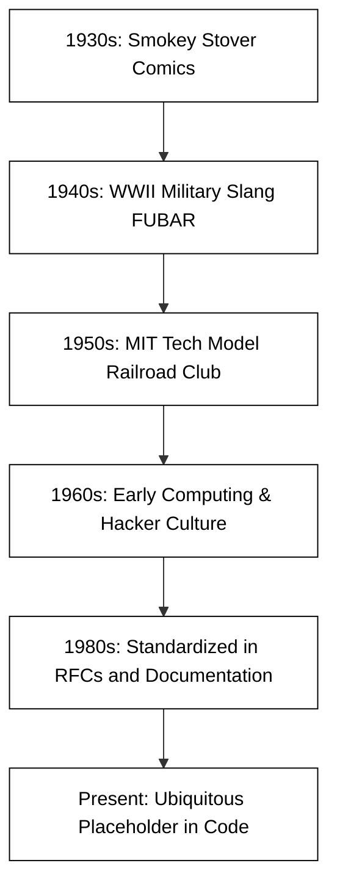

# foo

In the world of computer science and web programming, you will frequently encounter the words "foo," "bar," and "foobar." These aren't just random syllables; they are what programmers call **metasyntactic variables**. Just as a mathematician might use $x$ and $y$ to represent unknown numbers, or a lawyer might use "John Doe" to represent an anonymous person, developers use "foo" and "bar" as placeholder names for variables, functions, or files when the specific name is irrelevant to the concept being demonstrated.

Understanding the origin and usage of these terms is a rite of passage for new developers. It connects you to the history of the craft and helps you navigate documentation where these placeholders are used to illustrate logic without distracting the reader with specific domain-specific naming.

## The Etymological Mystery

The exact origin of "foo" is a subject of much debate and several competing theories. While it feels like a modern invention of the digital age, its roots stretch back to the early 20th century, long before the first electronic computer was built.

### The Comic Strip Connection
One of the earliest documented uses of "foo" appears in the 1930s comic strip *Smokey Stover* by Bill Holman. The titular character, a "fireman," frequently used the word "foo" in nonsensical contexts. Signs in the background of the comic would often read "Foomobile" or "Always Belittlin' Foo." Holman claimed he found the word on the bottom of a Chinese figurine, which purportedly meant "good luck," though this is likely apocryphal. The term became a popular nonsense word in American pop culture during that era.

### The Military Influence (FUBAR)
During World War II, the acronym **FUBAR** (Fouled Up Beyond All Recognition) became a common piece of military slang. When the war ended and the precursors to modern computing began to emerge in research laboratories, many veterans entered the field of engineering. It is widely believed that "foobar" is a "sanitized" or playful derivative of this military acronym, merging the nonsense "foo" from comics with the "bar" from FUBAR.

### The MIT Tech Model Railroad Club
The transition of "foo" from a general nonsense word to a technical staple happened largely at the Massachusetts Institute of Technology (MIT). In the 1950s and 60s, the Tech Model Railroad Club (TMRC) was a hub for early hacking culture. Members used "foo" as a term for a "munged" or broken piece of equipment. When these same students began working on early computers like the TX-0 and the PDP-1, they brought their jargon with them.

## The Evolution into Technical Standards

As the internet grew, so did the need for standardized documentation. The term became so ubiquitous that it was eventually codified in official internet documentation. **RFC 3092**, titled "Etymology of 'Foo'," was published by the Internet Engineering Task Force (IETF). While written with a sense of humor, it serves as a formal acknowledgment of the term's importance in the industry.



## Practical Examples in Programming

In this course, you will see "foo" used to demonstrate syntax. The goal is to show how a structure works without implying that the code belongs to a specific business case (like a "User" or a "ShoppingCart").

### Variable Assignment
If we want to show how to assign a string to a variable in JavaScript, we might use:
```javascript
let foo = "Hello World";
console.log(foo);
```

### Function Definitions
When explaining how arguments are passed into functions, using "foo" and "bar" helps the student focus on the *mechanism* of the data flow:
```javascript
function foo(bar) {
    return bar + " is now processed.";
}

// Calling the function
foo("Data");
```

In this example, "foo" represents the action, and "bar" represents the data. Because these names are nonsensical, your brain doesn't try to associate them with a real-world database or a specific UI element, allowing you to focus purely on the `function` and `return` keywords.

## Common Challenges and Best Practices

While "foo" is a helpful tool for learning, it can lead to some common pitfalls for beginning developers.

### The "Production Code" Trap
The most significant challenge is knowing when *not* to use these terms. You should never use "foo," "bar," or "baz" in production code or shared repositories.
*   **Problem:** Using placeholders makes code unreadable for teammates. A variable named `foo` provides no context about what data it holds.
*   **Solution:** In real projects, use descriptive names like `userEmail`, `calculatedTotal`, or `isLoggedIn`. Save "foo" for quick local tests or when you are asking a question on a forum like Discord or Stack Overflow.

### Beginner Confusion
New programmers often wonder if "foo" is a built-in keyword in the language, similar to `if`, `while`, or `function`.
*   **Problem:** A student might think they *must* use the word "foo" for a specific type of loop.
*   **Solution:** Always remember that "foo" is an arbitrary name. You could replace it with "apple," "banana," or "myData" and the code would function exactly the same way.

## Summary

"Foo" and its companion "bar" are more than just silly words; they are a bridge to the history of computing culture, originating from 1930s comics and 1940s military slang before being adopted by the hackers at MIT. In the context of web programming, they serve as essential placeholders that allow us to discuss abstract logic and syntax without getting bogged down in specific details. As you progress through the "Development Essentials" module, use these terms to experiment and learn, but always strive for clarity and descriptive naming in your actual applications.

For those interested in a deeper dive into the linguistic history of hacking, [RFC 3092](https://datatracker.ietf.org/doc/html/rfc3092) provides an exhaustive (and entertaining) look at the etymology of these foundational placeholders.