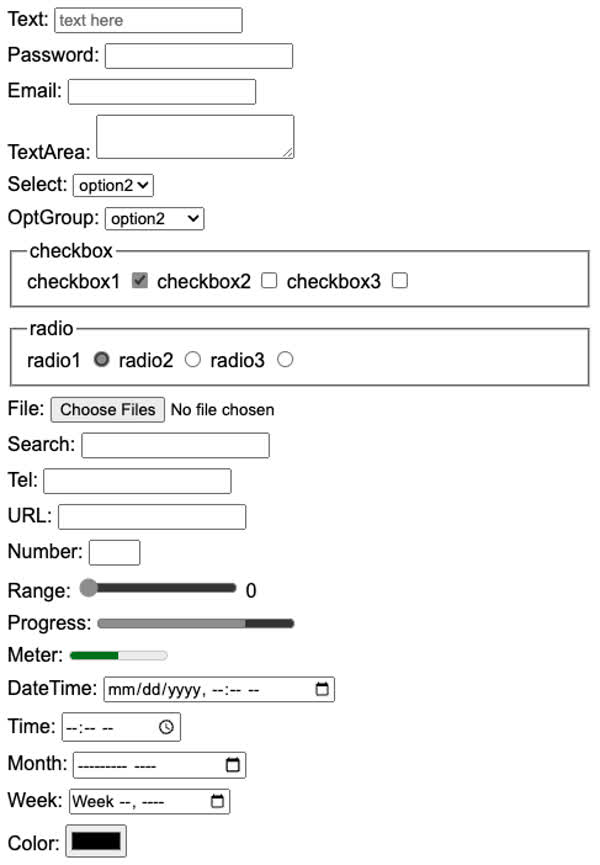

# HTML input elements

📖 **Deeper dive reading**: [MDN Input element](https://developer.mozilla.org/en-US/docs/Web/HTML/Element/input)

From the very early days of HTML it contained elements for accepting the input of user data. These elements include the following:

| Element    | Meaning                          | Example                                        |
| ---------- | -------------------------------- | ---------------------------------------------- |
| `form`     | Input container and submission   | `<form action="form.html" method="post">`      |
| `fieldset` | Labeled input grouping           | `<fieldset> ... </fieldset>`                   |
| `input`    | Multiple types of user input     | `<input type="" />`                            |
| `select`   | Selection dropdown               | `<select><option>1</option></select>`          |
| `optgroup` | Grouped selection dropdown       | `<optgroup><option>1</option></optgroup>`      |
| `option`   | Selection option                 | `<option selected>option2</option>`            |
| `textarea` | Multiline text input             | `<textarea></textarea>`                        |
| `label`    | Individual input label           | `<label for="range">Range: </label>`           |
| `output`   | Output of input                  | `<output for="range">0</output>`               |
| `meter`    | Display value with a known range | `<meter min="0" max="100" value="50"></meter>` |


# The HTML `<form>` Element

The `<form>` element is a container used to collect user input and send that data to a specified destination, typically a web server. It acts as the foundational structure for interactive components like login screens, search bars, and contact forms.


## Form element

The main purpose of the `form` element is to submit the values of the inputs it contains. Before JavaScript was introduced the `form` container element was essential because it was the only way for the browser to send the input data to a web server as part of a request to process the input and generate a new web page displaying the result of the input. With modern HTML, the form element is still important because it gives meaning to user input, works well with accessibility tools like screen readers, and relies on built-in browser features that handle input and submission reliably.

### Key Attributes

To function correctly, a `form` relies on two primary attributes:

1.  **`action`**: Defines the URL of the server-side resource (e.g., an API endpoint) that will process the submitted data.
2.  **`method`**: Specifies the HTTP method used to send the data.
    *   **`GET`**: Appends form data to the URL in name/value pairs. Used for non-sensitive data like search queries.
    *   **`POST`**: Sends data inside the body of the HTTP request. Used for sensitive information (like passwords) or when sending large amounts of data.


### Essential Child Elements

The `form` element wraps various interactive controls that allow users to enter data:

*   **`<label>`**: Provides a caption for an input. It improves accessibility and increases the clickable area for the associated field.
*   **`<input>`**: The most versatile element, used for text fields, checkboxes, radio buttons, and more, depending on its `type` attribute.
*   **`<textarea>`**: Used for multi-line text input.
*   **`<select>`**: Creates a drop-down list of options.
*   **`<button>`**: Used to submit the form (when `type="submit"`) or reset it (when `type="reset"`).

For data to be sent to the server, every input within the form must have a `name` attribute. The `name` acts as the key, and the user's input acts as the value (e.g., `username=JohnDoe`). Without the `name` attribute, the browser will not include that specific input's data in the submission.

### Example

Here is an example of a simple form that submits the value of a `textarea` element.

```html
<form action="submission.html" method="post">
  <label for="ta">TextArea: </label>
  <textarea id="ta" name="ta-id">
Some text
  </textarea>
  <button type="submit">Submit</button>
</form>
```

Try this out by modifying the text and pressing the submit button to simulate sending data to a web server. The browser generates the data by combining the textarea's `name` attribute with the current value of the textarea.

```masteryls
{"id":"c069b636-4426-4d32-b19f-1ef2379b5a72", "title":"Web page", "type":"web-page", "height":190}
<form id="messageForm">
  <label for="ta">TextArea: </label>
  <textarea id="ta" name="ta-id">Some text</textarea>
  <button type="submit">Submit</button>
</form>
<div id="message">... </div>

<style>
form { border: thin solid #efefef; padding: 1em;}
textarea { display:block; margin: .5em 0;}
#message { margin-top:1em;padding:1em;background:black;color:white;font-family:monospace; border:thin black solid; }
</style>
<script>
  const form = document.getElementById('messageForm');
  form.addEventListener('submit', function(event) {
    event.preventDefault(); // stop page reload

    const text = document.getElementById('ta').value.replace(' ', '+');
    const output = document.getElementById('message');
    output.innerText = `ta-id=${text}`;
  });
</script>
```


 With JavaScript we have much more control over input data and what is done with it. For example, in a single page application the JavaScript will dynamically rebuild the HTML elements to reflect the results of the user interaction. With this ability the data may not even be sent to the server. This greatly reduces the necessity of the `form` element, but it is often still used simply as a container. Just remember that you are not required to have a form element to use input elements.


### Form best practices

*   **Accessibility**: Always associate labels with inputs using the `for` attribute on the `<label>` and a matching `id` on the `<input>`.
*   **Validation**: Use attributes like `required`, `minlength`, and `pattern` to ensure data is formatted correctly before submission.
*   **Security**: Always use the `POST` method for forms that handle sensitive user data.


## Input element

Inside of your form elements you can include input element that represent many different input types. You set the type of input with the `type` attribute. There are several different types to choose from. This includes different flavors of textual, numeric, date, and color inputs.

| Type           | Meaning                           |
| -------------- | --------------------------------- |
| text           | Single line textual value         |
| password       | Obscured password                 |
| email          | Email address                     |
| tel            | Telephone number                  |
| url            | URL address                       |
| number         | Numerical value                   |
| checkbox       | Inclusive selection               |
| radio          | Exclusive selection               |
| range          | Range limited number              |
| date           | Year, month, day                  |
| datetime-local | Date and time                     |
| month          | Year, month                       |
| week           | Week of year                      |
| color          | Color                             |
| file           | Local file                        |
| submit         | button to trigger form submission |

In order to create an input you specify the desired `type` attribute along with any other attribute associated with that specific input. Here is an example of a checked radio button and its associated label.

```html
<label for="checkbox1">Check me</label> <input type="checkbox" name="varCheckbox" value="checkbox1" checked />
```

Most input elements share some common attributes. These include the following.

| Attribute | Meaning                                                                             |
| --------- | ----------------------------------------------------------------------------------- |
| name      | The name of the input. This is submitted as the name of the input if used in a form |
| disabled  | Disables the ability for the user to interact with the input                        |
| value     | The initial value of the input                                                      |
| required  | Signifies that a value is required in order to be valid                             |

The following shows what the inputs look like when rendered. Don't worry about how clunky they look right out of the box. We will fix that when we start styling things with CSS.



## Validating input

Several of the input elements have validation built into them. This means that they will not accept a value that is not for example, a number, a URL, outside of a range, or an email address. You can also specify the `required` attribute on an input element to mark it as requiring a value before it can be submitted. The `pattern` attribute exists on `text`, `search`, `url`, `tel`, `email`, and `password` inputs. When present, the pattern attribute provides a regular expression that must match for the input to be considered as valid.

You should also have validation built into your JavaScript that checks input data to ensure everything is valid before it is submitted. All of the input elements support functions for determining their validation state. Additionally, there are CSS style selectors for visualizing the validity of the input. In order to have a good user experience, it is critical that you provide sufficient user feedback early in the input process. A good design will give feedback as, or before, the user begins to input. A poor design will keep the user guessing as to why the data is not being accepted, or even if it was accepted.

## ☑ Assignment

This [CodePen](https://codepen.io/leesjensen/pen/dyVdNej) demonstrates all of the major input elements. Fork the pen and do the following:

1. Replace the text input's placeholder with "your name here".
1. Add an additional optgroup.
1. Add an additional checkbox.
1. Add an additional radio button.
1. Change the color input to default to red.

_If your section of this course requires that you submit assignments for grading_: Submit your CodePen URL to the Canvas assignment.
