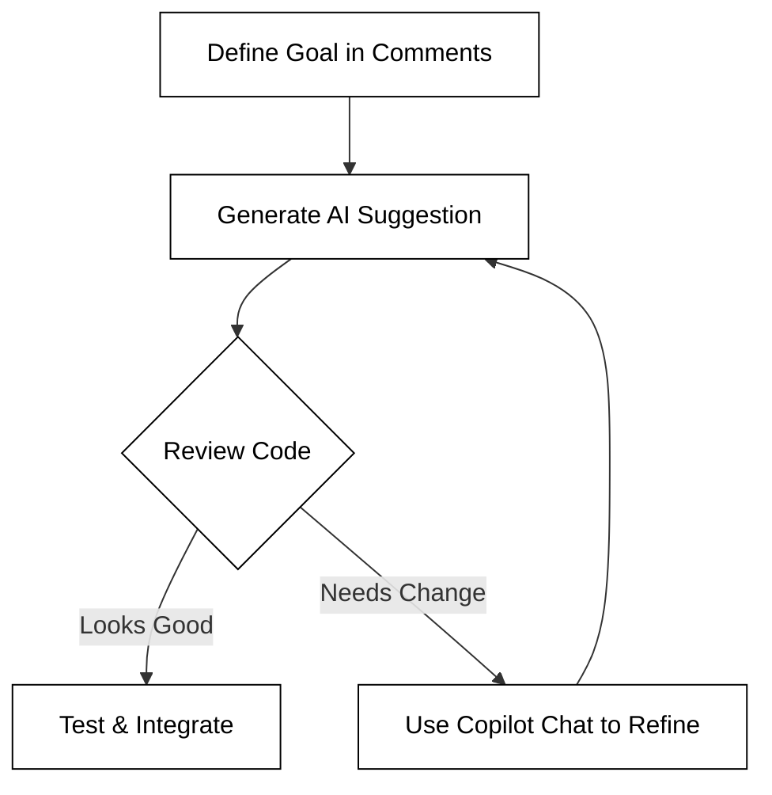

# Partnering with AI

The landscape of web programming is shifting from a focus on manual syntax memorization to a focus on architectural design and problem-solving. As you begin your journey into web development, you are entering an era where Artificial Intelligence (AI) acts as a collaborative partner rather than just a search engine. Learning to "partner" with AI means understanding how to leverage large language models to accelerate your learning, debug complex issues, and scaffold applications more efficiently than ever before.

In this section, we will explore the strategic advantages of using AI in your development workflow, how to access professional-grade tools for free as a student, and the practical steps to integrate these tools into your daily coding routine within Visual Studio Code.

## Why Use AI to Build Web Apps?

Modern web development involves a massive ecosystem of languages (HTML, CSS, JavaScript), frameworks, and cloud services. For a beginner, the sheer volume of syntax and configuration can be overwhelming. AI tools like GitHub Copilot serve as an "always-on" mentor that understands the context of your project.

Using AI provides several distinct advantages:

*   **Accelerated Learning:** Instead of spending hours searching through documentation for a specific CSS property, you can ask the AI to explain a concept or provide a snippet. This tightens the feedback loop between curiosity and implementation.
*   **Boilerplate Reduction:** Web apps often require repetitive setup code (like HTML headers or standard API fetch structures). AI can generate these patterns instantly, allowing you to focus on the unique logic of your application.
*   **Debugging Assistance:** When your code fails, you can provide the error message to the AI. It can often identify logical fallacies or syntax errors that are difficult for human eyes to spot after hours of coding.
*   **Exploration of Best Practices:** By observing the code an AI suggests, you are often exposed to modern ES6+ syntax and industry-standard patterns that you might not have encountered yet in basic tutorials.

## Securing Your GitHub Copilot Educational License

As a student, you have access to one of the most powerful AI coding assistants in the world—GitHub Copilot—at no cost. This is provided through the **GitHub Student Developer Pack**.

To get started, follow these steps:

1.  **Verify your Student Status:** Visit the [GitHub Education](https://education.github.com/pack) website and apply for the Student Developer Pack using your institutional email address. You may need to provide a picture of your student ID or other proof of enrollment.
2.  **Wait for Approval:** Verification can take anywhere from a few hours to a few days. Once approved, you will receive an email confirming your benefits.
3.  **Activate Copilot:** Once your pack is active, navigate to your GitHub account settings. Under the "Code, planning, and automation" section, look for "Copilot." If you are eligible through the student pack, it will allow you to enable the service for free.

Having a professional license ensures you have access to the latest models and features, such as GitHub Copilot Chat, which provides a more conversational interface for complex architectural questions.

## Integrating Copilot into Visual Studio Code

Once your license is active, you need to bring the AI into your development environment. Visual Studio Code (VS Code) is the primary editor for this course and has a first-class integration with Copilot.

### Installation
Open VS Code and navigate to the **Extensions** view (Ctrl+Shift+X or Cmd+Shift+X). Search for "GitHub Copilot" and install the extension. You will also want to install "GitHub Copilot Chat" for a more interactive experience. Once installed, you will be prompted to sign in to your GitHub account to authorize the extension.

### Interactive Development Workflow
Using Copilot is not about letting the AI write the app for you; it is an iterative conversation. The most effective way to use it is through a "Comment-to-Code" workflow.

1.  **Write a Prompt:** Start by writing a comment in your code file describing what you want to achieve. For example: `// Create a function that fetches weather data from an API`.
2.  **Evaluate Suggestions:** As you type, Copilot will suggest "ghost text" (grayed-out code). Press `Tab` to accept it or keep typing to ignore it.
3.  **Refine via Chat:** If the suggestion isn't quite right, open the Copilot Chat sidebar or press `Cmd+I` (Mac) or `Ctrl+I` (Windows) to open the inline chat. You can give specific instructions like "Make this function use async/await" or "Add error handling to this block."



## Practical Example: Building a Component

Imagine you are building a feature for your "Simon" game or your startup application. You need a button that changes color when clicked. 

Instead of searching for the syntax, you might type:

```sh
Function to toggle the 'active' class on a button and play a sound
```

Copilot might suggest:
```javascript
function handleButtonClick(event) {
    const button = event.target;
    button.classList.toggle('active');
    const audio = new Audio('sounds/click.mp3');
    audio.play();
}
```

At this point, your job as the developer is to verify: Does the `sounds/click.mp3` file exist? Is `event.target` the correct element in this context? The AI provides the foundation, but you provide the validation.

## Common Challenges and Solutions

While AI is powerful, it is not infallible. Students often encounter these common hurdles:

*   **Hallucinations:** AI may suggest libraries that don't exist or use deprecated syntax. 
    *   *Solution:* Always test the code immediately. If it doesn't work, ask the AI, "Is this using the most recent version of the API?"
*   **Over-reliance:** It is tempting to `Tab` through an entire file without reading the code.
    *   *Solution:* Make it a rule to explain every line of AI-generated code to yourself. If you don't understand what a line does, ask the AI: "Explain this specific line of code to me."
*   **Context Blindness:** Sometimes the AI forgets the structure of your other files.
    *   *Solution:* Keep relevant files open in your VS Code tabs. Copilot uses open tabs to understand the context of your project.

## Summary

Partnering with AI is a core competency for modern web developers. By utilizing GitHub Copilot within VS Code, you can bridge the gap between a conceptual idea and a working prototype much faster. However, the AI is a "Co-pilot," not the "Pilot." You remain responsible for the logic, security, and maintenance of your code. Use the GitHub Student Developer Pack to your advantage, engage with the AI interactively, and always maintain a critical eye toward the code it generates.

For further reading on effective prompting, check out the [GitHub Copilot Documentation](https://docs.github.com/en/copilot).