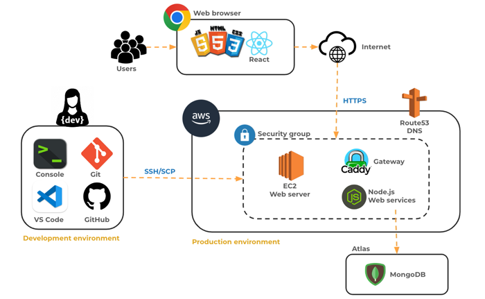

# Startup AWS




## Grading Rubric

> [!IMPORTANT]
>
> Submit your Startup URL that includes your domain name for this deliverable (e.g. `https://startup.yourdomain`). **Do not** submit your GitHub repository URL.

- **Prerequisite**: Notes in your startup Git repository README.md file documenting what you modified and added with this deliverable. The TAs will only grade things that have been clearly described as being completed. Review the [voter app](https://github.com/webprogramming260/startup-example) as an example.

- 20% Rented an EC2 server from AWS and it is accessible.
- 20% Leased a domain name and associated it with my server.
- 80% My server is available using your hostname. For example: `https://yourdomainnamehere.click`


```masteryls
{"id":"6edadab4-91ee-46f0-952e-469f42dc841e", "title":"Startup AWS Deliverable", "type":"url-submission", "syncGrade":true, "autoGrade":true, "gradingCriteria":"The content must contain the text `web programming 260`. The URL protocol must be HTTPS." }
After completing all the prerequisites and rubric items, submit the URL to your startup server. The server must be up and running correctly.

_Example: https://mydomainname.click_
```


## Go celebrate

You did it! You now have a web server that can be seen by anyone in the world.
